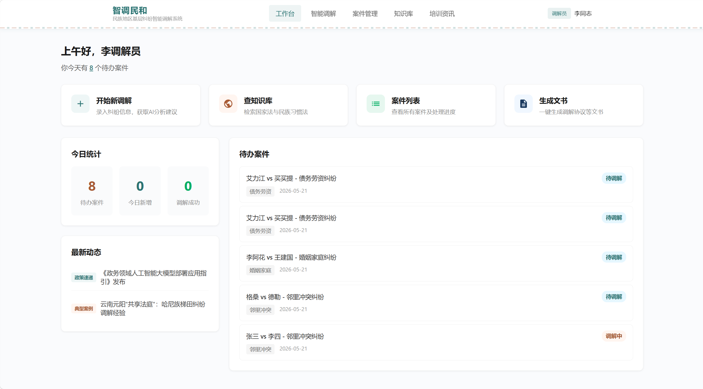
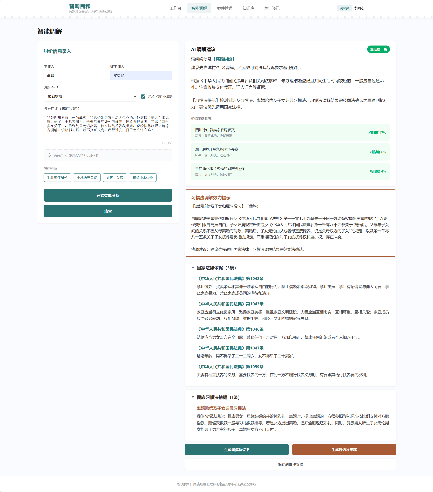
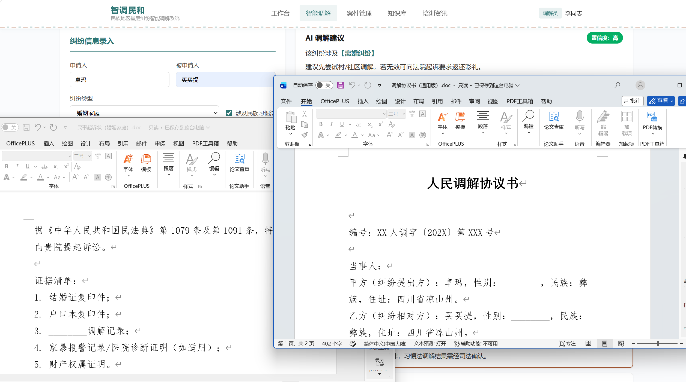
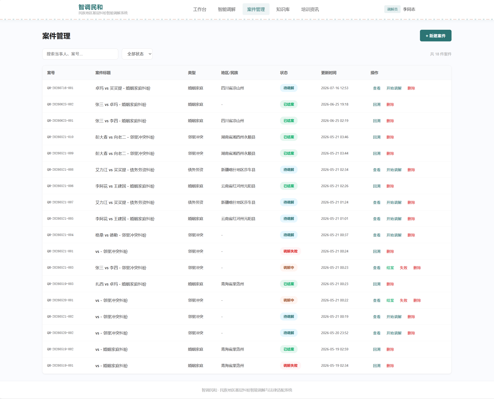
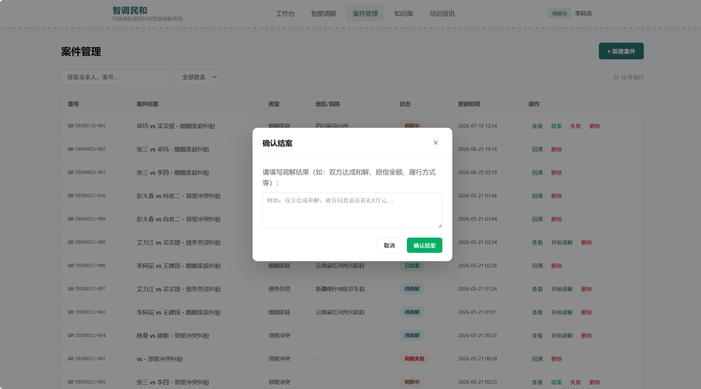
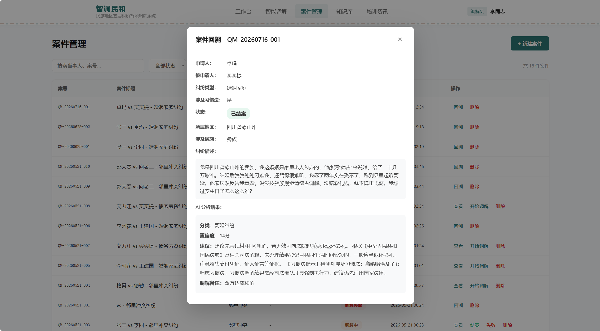
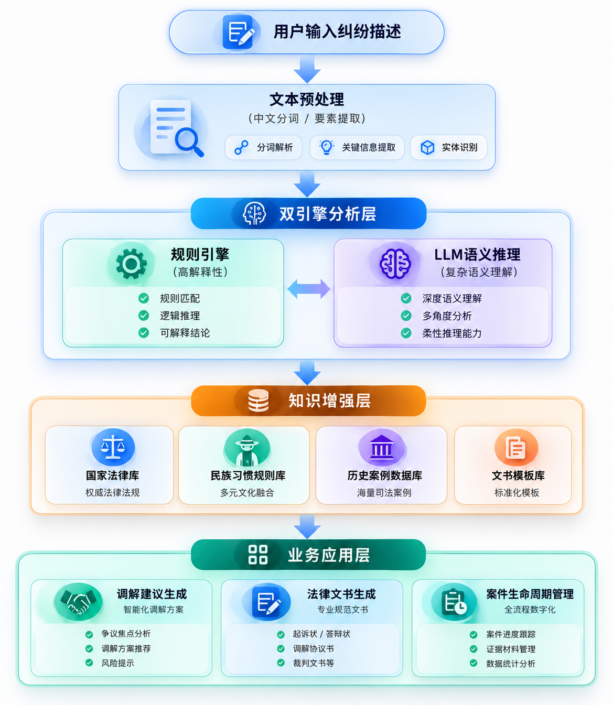
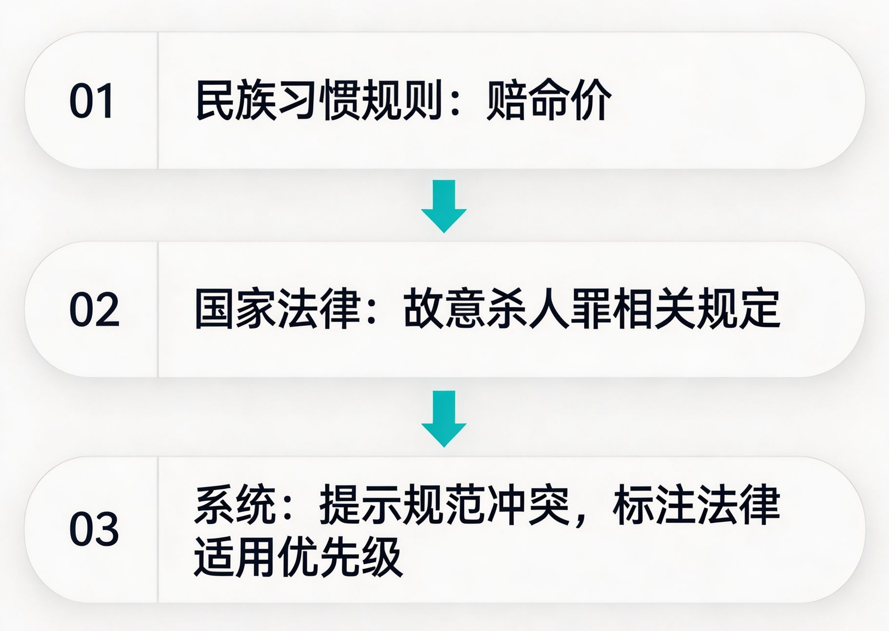
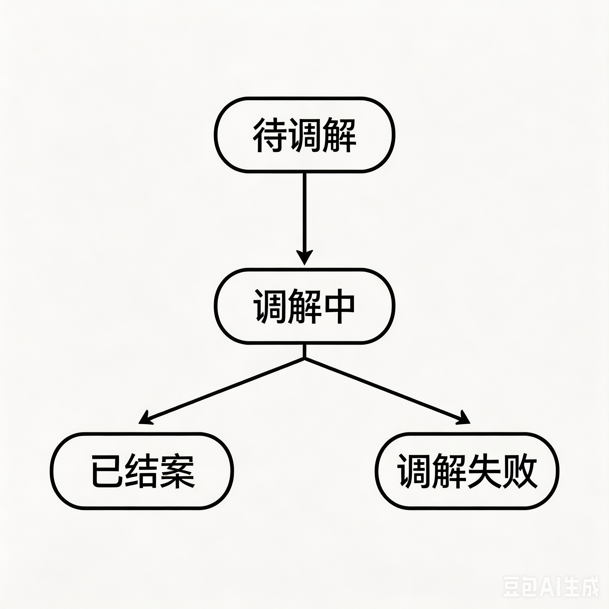

<div align="center">

# 智调民和 —— 民族地区基层纠纷智能调解与法律适配系统

**基于“规则引擎 + LLM语义推理”的法律知识增强型智能辅助决策系统。**

**面向民族地区基层纠纷处理中“国家法与民族习惯法并存”的复杂场景，实现纠纷识别、法律适配、习惯法冲突检测与调解辅助决策。**

[](https://react.dev/)
[](https://fastapi.tiangolo.com/)
[](https://www.python.org/)
[](./LICENSE)

</div>

---

## 项目背景

民族地区基层纠纷处理中，调解员不仅需要判断事实关系，还需要协调国家法律规范与地方习惯规则之间的关系。传统智能调解系统主要依赖单一法律知识检索，难以处理：

1. 民族习惯法与国家法律存在冲突时的效力判断；

2. 非标准化口语描述中的纠纷类型识别；

3. 基层场景下案件持续管理与历史追踪。

因此，本项目探索一种：“法律知识库 + 民族习惯法知识库 + LLM语义推理”的混合智能辅助调解框架。

系统基于 React + FastAPI 前后端分离架构，实现从纠纷录入、智能分析、法律适配、调解建议生成到案件管理的完整业务流程。

---

## 系统展示

### 工作台




### 智能调解：纠纷分析与文书生成






### 案件管理







---

## 核心功能

| 功能模块 | 技术方案 |
|---------|------|
| **纠纷语义解析** | 双层级权重规则引擎 + LLM语义推理，实现非结构化纠纷文本分类 |
| **双法律知识融合** | 构建国家法律库与民族习惯法库，进行冲突检测与效力优先级标注 |
| **案件生命周期管理** | SQLite结构化案件数据库，实现状态流转、历史回溯与数据闭环 |
| **法律文书生成** | 模板驱动生成7类法律文书，实现字段自动填充与规范化输出 |
| **智能调解辅助** | 基于案件类型、法律依据和习惯规则生成调解建议 |
| **知识库检索** | 国家法律库 + 民族习惯法库动态检索 |

---

## 技术架构
本项目采用“前后端分离 + 双引擎智能分析 + 知识增强”的系统架构。

整体流程如下：



---

## 快速开始

### 环境要求
- Node.js ≥ 18
- Python ≥ 3.10
- DeepSeek API Key

### 启动前端
```bash
cd frontend
npm install
npm start
```

### 启动后端
```bash
cd backend
pip install -r requirements.txt
export DEEPSEEK_API_KEY="your_api_key"
python main.py
```

---

## 项目结构

```
QingMiao/

├── frontend/
│
│   ├── src/pages/
│   │
│   │   ├── Dashboard.jsx
│   │   ├── Mediation.jsx
│   │   ├── Cases.jsx
│   │   ├── Knowledge.jsx
│   │   └── Training.jsx
│   │
│   └── package.json
│

├── backend/

│   ├── main.py
│
│   ├── routers/
│   │   # API接口
│
│   ├── services/
│   │   # 规则引擎
│   │   # 习惯法匹配
│   │   # 文书生成
│
│   ├── models/
│   │   # 数据模型
│
│   └── data/
│       # 法律知识库
│       # 关键词库
│       # 文书模板
│
└── README.md
```

---

## 技术挑战与创新点

### 1. 民族习惯法与国家法律的冲突建模

区别于传统法律问答系统仅基于单一法律知识库进行检索，本项目针对民族地区基层治理中“国家法与民族习惯法并存”的复杂场景，显式构建二元规范体系：
- **民族习惯规则库**：收录典型民族习惯规则及适用场景；
- **国家法律规范库**：关联现行法律条文及司法解释；
- **冲突关系建模**：识别习惯规则与国家法律之间的潜在矛盾；
- **效力优先级判断**：辅助调解人员理解不同规范的适用边界。

示例：



该设计使系统不仅能够回答“适用什么法律”，还能够辅助分析“为什么存在法律适配问题”。

---

### 2. 从“一次性分析工具”到业务闭环系统

传统智能文本分析系统通常只完成单次分类或检索任务，难以支持基层调解工作的持续管理。

本项目设计案件全生命周期管理机制：




支持：

- 案件状态动态流转；
- 调解过程记录与信息回填；
- 历史案件查询与复盘分析；
- 后续知识库积累与模型优化。

---

### 3. 从规则系统向知识增强生成（RAG）系统演进

当前系统采用“规则引擎 + LLM语义推理”的混合架构，在保证可解释性的同时降低大模型调用成本。

未来将进一步探索知识增强生成方向：

- 使用 **Embedding + Vector Database** 替代传统 TF-IDF 方法，实现基于语义理解的法律案例检索；
- 构建 **RAG（Retrieval-Augmented Generation）框架**，融合国家法律库、民族习惯法库与历史案例，实现法律依据增强生成；
- 探索领域大模型适配方法，包括 **Prompt Engineering、LoRA微调** 等技术，提高模型对基层司法场景的理解能力。

---

## 未来扩展

### 1. RAG增强法律知识检索

当前系统主要依赖规则匹配与结构化知识检索，未来计划引入向量化语义检索技术：

- 使用文本Embedding表示法律条文、案例及习惯规则；
- 构建向量数据库，实现复杂纠纷的语义级匹配；
- 结合RAG框架提升法律依据推荐与调解建议生成质量。

---

### 2. 法律领域大模型适配

针对基层司法领域专业术语多、业务规范复杂的问题，未来探索：

- 领域Prompt设计与优化；
- 法律知识指令微调；
- LoRA等参数高效微调方法。

提升大模型在民族地区基层纠纷理解、法律适配和辅助决策任务中的表现。

---

### 3. 民族语言多模态纠纷理解

民族地区存在多语言、多表达方式并存的实际情况，未来探索：

- 汉语与民族语言文本融合；
- 语音识别与文本理解结合；
- 多模态信息融合的纠纷分析框架。

进一步提升系统在真实基层环境中的适用能力。

---

## 许可证

[MIT License](./LICENSE)
